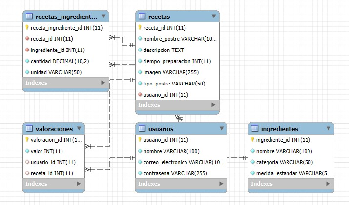

# app-ChefHub
## Introducción
El proyecto ChefHub se trata de una Aplicación Web que servirá como un repositorio de recetas de postres ecuatorianos, la cual será una herramienta útil tanto para entusiastas de la cocina como para aquellos interesados en la gastronomía ecuatoriana, proporcionando una colección diversa de recetas detalladas. Además, ChefHub busca rescatar y preservar el patrimonio culinario del Ecuador, fomentando la transmisión de conocimientos gastronómicos entre generaciones y contribuyendo a la difusión de la identidad cultural del país.

### Propósito
El propósito principal de ChefHub es ofrecer una plataforma digital accesible y organizada que permita a los usuarios explorar y aprender recetas tradicionales de postres ecuatorianos. Al centralizar este conocimiento en un solo espacio, se pretende no solo facilitar el acceso a estas recetas, sino también incentivar su preparación y consumo fortaleciendo el vínculo cultural entre las personas y su patrimonio gastronómico.

### Objetivos
- **Promover la gastronomía ecuatoriana y mundial:** Crear una plataforma que difunda recetas tradicionales y contemporáneas, poniendo especial énfasis en los postres ecuatorianos, para preservar y compartir la riqueza cultural culinaria.

- **Facilitar el acceso a recetas organizadas:** Proveer una herramienta digital que permita a los usuarios explorar, guardar y organizar recetas de manera eficiente y personalizada.

- **Fomentar la creatividad culinaria:** Brindar un espacio donde los usuarios puedan compartir sus propias recetas, intercambiar ideas y aprender nuevas técnicas de cocina.

- **Ofrecer una experiencia de usuario intuitiva y atractiva:** Desarrollar una aplicación con una interfaz amigable que simplifique la navegación, haciendo que explorar y cocinar sea más accesible para todos.
  

## Contexto del Problema
### Definición del problema
La gastronomía ecuatoriana, conocida por su riqueza cultural y diversidad, carece de una plataforma digital centralizada que recopile y preserve recetas auténticas de postres tradicionales. Aunque el patrimonio inmaterial, como las recetas culinarias, es crucial para la identidad cultural, la UNESCO advierte que su transmisión oral y la falta de documentación adecuada ponen en riesgo su preservación.

Plataformas internacionales como Cookpad y Tasty han demostrado el éxito de herramientas digitales para compartir recetas, pero rara vez incluyen representaciones fieles de la gastronomía ecuatoriana, dejando un vacío significativo en su difusión.

Ante esta realidad, surge la necesidad de una plataforma digital accesible y funcional que permita descubrir, compartir y valorar recetas auténticas de postres ecuatorianos, con funciones avanzadas de búsqueda y una interfaz intuitiva. De esta manera, el proyecto ChefHub busca contribuir activamente al rescate y difusión del patrimonio gastronómico del país.

### Justificación del proyecto
Desarrollar una plataforma digital que centralice y organice recetas de postres ecuatorianos resuelve el problema de la dispersión de información. Al permitir que los usuarios compartan sus recetas, se fomenta la interacción comunitaria y el enriquecimiento cultural. Además, una base de datos bien estructurada garantiza un acceso rápido y eficiente a las recetas, mejorando la experiencia del usuario.

## Analisis de requerimiento 
Busca ser una plataforma única que recopile recetas de postres ecuatorianos, permitiendo a los usuarios descubrir, compartir y valorar recetas tradicionales. Para lograr esto, es esencial definir con claridad todas las necesidades del sistema, cómo se gestionarán los datos, y cuál será la lógica de negocio. A continuación, se presenta un análisis detallado, abarcando tanto las necesidades funcionales como no funcionales, asegurando que todos los aspectos del sistema estén cubiertos de manera comprensible y humanizada.

## Funcionalidades Clave:
### 1. Recetas Tradicionales Detalladas:
La aplicación ofrece una colección de recetas ecuatorianas explicadas paso a paso, incluyendo ingredientes, instrucciones detalladas y fotografías ilustrativas para facilitar su preparación.

### 2. Navegación Intuitiva:
Una estructura clara y accesible permite a los usuarios explorar fácilmente las distintas recetas a través de un diseño simple y amigable.

### 3. Organización de Recetas Individuales:
Cada receta cuenta con su propia página dedicada, donde se presenta información completa, manteniendo un diseño consistente y atractivo.

### 4. Vínculos Rápidos y Dinámicos:
Botones integrados que facilitan la navegación entre la página principal, la lista de recetas y las recetas individuales, mejorando la experiencia del usuario.

### 5. Adaptabilidad Visual:
Un diseño adaptable que permite que la aplicación sea funcional y visualmente atractiva tanto en dispositivos móviles como en computadoras de escritorio.

   
## Modelo Relacional

   
## Tablas Principales

  1. Usuarios: Almacena información sobre los usuarios registrados.
  2. Recetas: Almacena información detallada sobre cada receta de postre ecuatoriano.
  3. Ingredientes: Contiene una lista de ingredientes comunes utilizados en las recetas.
  4. Recetas_Ingredientes: Relaciona cada receta con los ingredientes necesarios, especificando la cantidad requerida para cada uno.

NOTE: Podrá descargar el scrip con el modelo fisico. 

## Diseño del Sistema

### 1. Arquitectura General
El sistema está basado en el marco de trabajo Django y sigue el patrón de diseño Modelo-Vista-Controlador (MVC). Los componentes principales son:

Modelo: Se extiende el modelo de receta para almacenar la información necesaria, como el título, ingredientes, pasos de preparación e imagen. Esto permite persistir los datos en la base de datos.
Vista: Se crea una vista dedicada para manejar la lógica de subida de recetas, generación de páginas dinámicas y redirección.
Plantillas (Templates): Se utiliza el sistema de plantillas de Django para renderizar dinámicamente las páginas de las recetas y actualizar la página de servicios.

### 2. Flujo de Trabajo del Usuario
- **Acceso al Formulario de Subida:**
El usuario registrado puede acceder al formulario mediante un botón en la página de recetas. Este formulario permite ingresar:
- Título de la receta.
- Lista de ingredientes (uno por línea).
- Pasos de preparación (uno por línea).
- Imagen representativa de la receta (opcional).
- **Validación y Procesamiento de Datos:**
Al enviar el formulario, el sistema valida los datos ingresados. Si todo es correcto:
- Se almacena la información en la base de datos.
- Se genera automáticamente una página HTML para la receta con un diseño consistente.
- **Redirección Automática:**
Una vez procesados los datos, el sistema redirige al usuario a la nueva página de la receta, permitiéndole visualizarla inmediatamente.
- **Actualización de la Página de Servicios:**
La nueva receta aparece automáticamente en la sección de servicios mediante una tarjeta visual (card) que incluye:
- El título de la receta.
- Una imagen representativa.
- Un enlace directo a la página de la receta.

### 3. Generación Automática de Páginas
El sistema utiliza un método en la vista para generar un archivo HTML dinámico por receta. Las características clave de este proceso incluyen:
- **Nombre del archivo dinámico:** El nombre del archivo HTML corresponde al título de la receta en formato URL-friendly.
- **Estructura del contenido:**
La página se genera extendiendo la plantilla base de la aplicación (base.html) para garantizar la consistencia visual.
- **Contenido dinámico:**
- Título de la receta.
- Imagen vinculada desde el directorio estático.
- Listas y pasos generados a partir de los datos ingresados.

### 4. Modificación de la Página de Servicios
Se utiliza un bucle dinámico en la plantilla services.html para recorrer y mostrar todas las recetas disponibles. Esto se logra con:
- **Carga de datos desde la base de datos:** Cada receta se representa como una tarjeta (card) con los datos relevantes.
- **Estilo coherente:** Se reutilizan los estilos existentes para garantizar un diseño uniforme.

### 5. Manejo de Errores
El sistema incluye validaciones y manejo de errores para garantizar una experiencia de usuario fluida:
- Validación de campos obligatorios en el formulario.
- Manejo de imágenes faltantes o con formatos no permitidos.
- Redirección a una página de error si ocurre un problema inesperado.

### 6. Tecnologías y Herramientas Utilizadas
- Django: Para la gestión del backend y la lógica de generación dinámica de páginas.
- HTML y CSS: Para las plantillas y el diseño visual de las páginas.
- SQLite: Base de datos para almacenar las recetas.
- Bootstrap: Para garantizar un diseño responsivo y atractivo en las páginas.
- Jinja2: Motor de plantillas integrado en Django para la generación dinámica de contenido.

